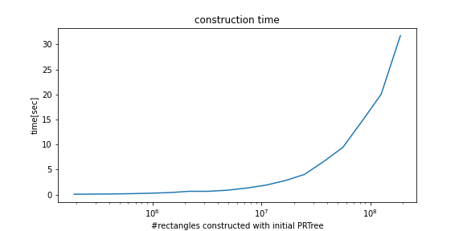
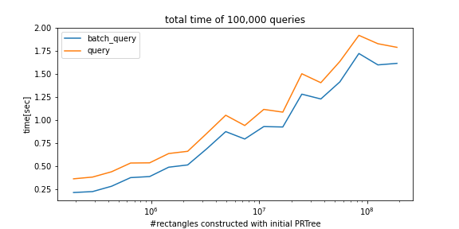
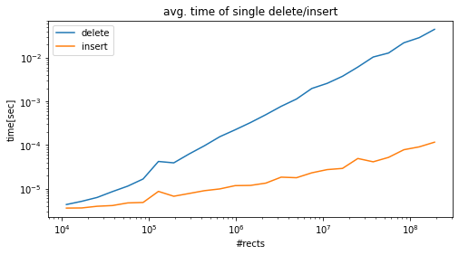

# python_prtree

"python_prtree" is a python implementation of Priority R-Tree (see reference below).
Supported futures are as follows:

- Construct Priority R-Tree(PRTree) from rectangles
- query and batch query with rectangle(s)
- insert and erase(delete) (but not optimized yet)

**This package is mainly for nearly static situations, which mean few insert/delete events happen (e.g., mapmatching).**

# Usage 
```python
import numpy as np
from python_prtree import PRTree

idxes = np.array([1, 2])  # must be unique because using idx as key for hash map
rects = np.array([[0.0, 1.0, 0.0, 0.5],
                  [1.0, 1.2, 2.5, 3.0]])  # (xmin, xmax, ymin, ymax)

prtree = PRTree(idxes, rects)  # initial construction

q = np.array([[0.5, 0.6, 0.2, 0.3],
              [0.8, 1.5, 0.5, 3.5]])
result = prtree.batch_query(q)
print(result)
# [[1], [1, 2]]
```

1d-array batch query will be implicitly treated as batch with size = 1.
If you want 1d result, please use `query` method.
```python
result = prtree.query(q[0])
print(result)
# [1]

result = prtree.batch_query(q[0])
print(result)
# [[1]]
```


You can also erase(delete) by index and insert new one.
```python
prtree.erase(1)  # delete the rectangle with idx=1 from the initail PRTree

prtree.insert(3, np.array([0.3, 0.5, 0.1, 0.2]))  # add a new rectangle to the PRTree
```

# Installation
Install python_prtree with pip command.
```bash
pip install git+https://github.com/atksh/python_prtree
```

Or, you can clone and pip just like
```bash
git clone --recursive git@github.com:atksh/python_prtree.git
cd python_prtree
python setup.py test; rm -rf build  #(this line is optional. build dir disturbs pip installing)
pip install .
```

# Performance
## Construction


## Query and batch query


## Delete and insert


# Requirement
- numpy
- openmp
- gcc


# NOTE

- This PRTree is implemented by C++ with Pybind11, and much faster than numba implementation of PRTree.
- If you can use C++, you should use boost::geometry (I didn't know it and sadly made this package).
- Please note that insert / erase operations are not optimized compared to ordinary r-tree. Plus, this implementation does not exactly follow that of the paper due to my technical skills.


# Reference
The Priority R-Tree: A Practically Efficient and Worst-Case Optimal R-Tree
Lars Arge, Mark de Berg, Herman Haverkort, and Ke Yi
Proceedings of the 2004 ACM SIGMOD International Conference on Management of Data (SIGMOD '04), Paris, France, June 2004, 347-358. Journal version in ACM Transactions on Algorithms.
[author's page](https://www.cse.ust.hk/~yike/prtree/)
